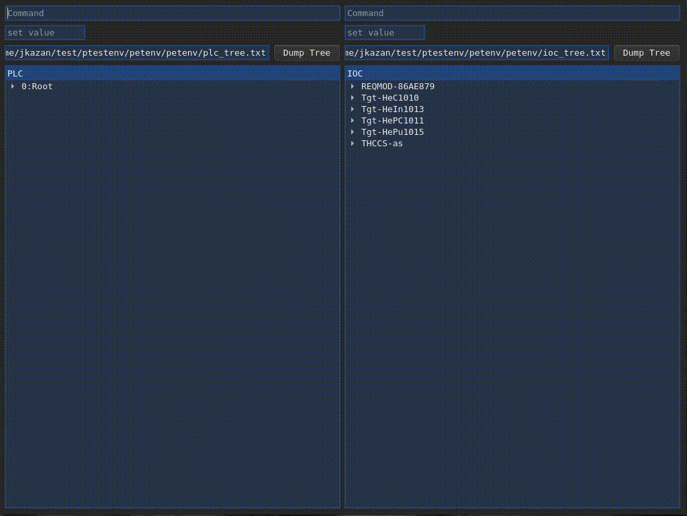

# `p`lc `e`pics `t`est `env`ironment (`petenv`)
#### ToC
- [Introduction](#introduction)
- [Installation](#installation)
  - [Python3](#python3)
  - [venv](#venv)
  - [petenv](#petenv)
- [Configuration](#configuration)
- [Usage](#usage)
  - [Run Test Script](#run-test-script)
  - [Parallelize tests](#parallelize-tests)
  - [alarm_test.py](#alarm_test.py)
  - [Generating Test Report](#generating-test-report)
    - [Additional Test Environment Information](#additional-test-environment-information)
  - [Generating Test Documentation](#generating-test-documentation)
  - [GUI](#gui)
- [Supporting Packages](#supporting-packages)

# Introduction


`petenv` includes necessary packages to make automated tests of the the communication chain from PLC to EPICS. This implies full system testing including control system behavior on the PLC level as well as OPerator Interfaces (OPIs), alarms and other EPICS services. Furthermore, `petenv` comes with a couple of aiding utilities: As graphical interface, allowing the user to browse tree structures of both PLC and IOC in parallell, and manipulate values; A generic alarm test script, finding all transmitters and on-off valves in a system and verifying that all alarms work and no conflicts are found (e.g. a HIHI alarm being lower than a HI alarm); A selection of simple simulators of e.g. transmitter and on-off valves.

`petenv` utilizes the python3 library [`pytest`](https://docs.pytest.org/en/latest/), which makes it easy to write small tests, yet scales to support complex functional testing for applications and libraries. To aid communication, [`opcua`](https://python-opcua.readthedocs.io/en/latest/) is used for direct communication with PLCs (or any OPCUA server) and [`pyepics`](https://github.com/pyepics/pyepics) for direct communication with EPICS IOCs.

`petenv` allows for your simplest tests, and long chains of system behavior between PLC and IOC. You can make sure that setting a parameter value in EPICS is seen by the PLC, or you can simulate an operator starting a pump from the operators' screen, and verify that your system opens that valve you expected, the pressure decreased and the LED in the operators' screen turned on.

**Unit testing** is foremost referring to the testing of a function or method. The goal of a single unit test is to test only some permutation of the unit under test. An **integration test**, on the other hand, is a different form of testing in which the interaction between two or more units is explicitly tested. Integration tests verify that the components of your application work together. 

Unit testing often provides the opportunity to obtain better coverage: It's usually possible to supply a unit under test with arguments and/or an environment which causes all of its potential codepaths to be executed. This is usually not as easy to do with a set of integration or functional tests, but integration and functional testing provides a measure of assurance that your "units" work together, as they will be expected to when your application is run in production.

## Installation

### Python3 
###### CentOS
If you are running Centos, the following commands will install packages needed to make Python 3.6 available, and finally install Python 3.6:
``` sh
sudo yum install centos-release-scl
sudo yum install https://rhel7.iuscommunity.org/ius-release.rpm
sudo yum install python36u-pip
```
###### Ubuntu
``` sh
sudo apt-get install python3.6
```
### venv
It is recommended to install petenv under a virtual environment. E.g. [venv](https://docs.python.org/3/library/venv.html) is a tool to create isolated Python environments.
``` sh
python3 -m venv petvenv      # Create virtual python environment
source petvenv/bin/activate  # Activate the environment
pip install --upgrade pip    # Upgrade python package manager
```

### petenv
Installing `petenv`, using the setup.py script, automatically installs all dependencies needed. If you are using an isolated python environment, don't forget to activate it as mentioned in the [venv](#venv) section above.
``` sh
cd petvenv
git clone https://gitlab.esss.lu.se/icshwi/petenv.git
cd petenv
python3 -m pip install .
```

## Configuration
Configuration is optional, but recommended. For testing with `pytest` it is recommended to make a copy (or symlink) of the `conftest.py` file into the local directory of your test scrips. `conftest.py` will ask you for system information during runtime if needed. However, you can avoid this by editing the file (the file contains instructions inside, on how to do so).

Similarly, `alarm_tests.py` will ask for the ip address of you PLC upon running, and can also be edited in the file to avoid being asked for ip every time.

Caveat: These standard tests are work in progress. The purpose is to provide standardized simple tests to e.g. test all transmitter alarms. The script will, based on the provided IP address in `conftest.py` find all transmitters in your PLC program and utilize both OPCUA and Channel Access to verify that all alarms work as expected, e.g. HIHI, HI, LO, LOLO, IO-Error for transmitters and opening timeout, closing timeout and IO-Error for solenoid valves.

## Usage

### Run Test Script
You can run a very simple example provided by this repository. This test cast contains three tests. The last test is designed to fail just to demonstrate what the pytest ouput looks like.
``` sh
cd petenv/test/
pytest -vs test_script_example.py
```
The expected output should look something like this:
``` sh
========================= 2 passed, 1 xfailed in 0.05s =========================
(pet-test) master pytest -vs test_script_example.py    ~/test/test/petenv/petenv
============================= test session starts ==============================
platform linux -- Python 3.6.8, pytest-5.3.1, py-1.8.0, pluggy-0.13.1 -- /home/jkazan/test/pet-test/bin/python3
cachedir: .pytest_cache
metadata: {'Python': '3.6.8', 'Platform': 'Linux-4.20.13-042013-generic-x86_64-with-LinuxMint-19.1-tessa', 'Packages': {'pytest': '5.3.1', 'py': '1.8.0', 'pluggy': '0.13.1'}, 'Plugins': {'html': '2.0.1', 'metadata': '1.8.0'}, 'JAVA_HOME': '/usr/lib/jvm/java-8-openjdk-amd64/'}
rootdir: /home/jkazan/test/test/petenv
plugins: html-2.0.1, metadata-1.8.0
collected 3 items                                                              

test_script_example.py::test_lower PASSED                                [ 33%]
test_script_example.py::test_add PASSED                                  [ 66%]
test_script_example.py::test_bad_add XFAIL                               [100%]

========================= 2 passed, 1 xfailed in 0.05s =========================
```

### Parallelize tests
If you have many tests that are independant of each other, you can create multiple workers to run several tests in parallell. To enable this, it is important to set your PLC's IP address in `conftest.py`. 
Examples:
``` sh
pytest alarm_test.py --workers 4
pytest alarm_test.py --workers auto
```

### alarm_test.py
As briefly mentioned, `petenv` includes, what is intended to be, a standard arlarm test. This script will automatically find all your system's standard devices and, via OPCUA and channel access, trigger alarms and functions and verify that all behavior is correct.

Caveat: These standard tests are work in progress. The purpose is to provide standardized simple tests to e.g. test all transmitter alarms. The script will, based on the provided IP address in `conftest.py` find all transmitters in your PLC program and utilize both OPCUA and Channel Access to verify that all alarms work as expected, e.g. HIHI, HI, LO, LOLO, IO-Error for transmitters and opening timeout, closing timeout and IO-Error for solenoid valves.

### Generating Test Report
`petenv` also utilizes pytest-html to auto-generate test reports. This can be run as follows:
``` sh
pytest -vs test_script_example.py --html=report.html
```

##### Additional Test Environment Information
To add additional environment metadata to your report (located in the top of the report), copy `conftest.py` from petenv to the directory where your test script is located and follow the instructions below...

Add the metadata flag followed by a key/value pair where the key is `petenv` and an arbitrary value (you may use this as an opportunity for a note or comment). `petenv` will ask you about information that will help finding metadata. If you want to skip any of the fields, jsut hit enter without entering any information and `petenv` will ignore it. Here is what it can look like:
``` sh
$ pytest -vs test_script_example.py --metadata petenv "Note: Network issues may cause longer test durations than expected" --html=report.html
Path to petenv repository: ~/test/ptestenv/petenv
Path to PLC Factory repository: ~/ics_plc_factory
Path to OPI repository: ~/ess-opis
PLC IP: 172.30.4.163
PLC program path in VersionDog: \=ESS\TS [Target Station]\CUP [Cooling & Utility]\E01 [He Cooling]\K02 [THCCS]\THCCS
PLC program version in VersionDog: 4
Path to pvlist: ~/thccs/THCCS_PVs.list
```
It is possible to add additional, arbitrary, key/value pairs to the metadata field in the report, e.g.:
``` sh
pytest -vs test_script_example.py --metadata foo bar --html=report.html
```

To create a list of PVs, which `petenv` metadata asks for, run the following command inside the epics shell:
``` sh
dbl > "<path to output file>"
```
Note: It is necessary that the this list is updated after your last IOC startup. This is because E3 creates PV names for EPICS module versions that depend on the epics shell process ID (PID).
It is recommended that the command above is added in the bottom om your IOC startup script. That way, this will be updated every time you run your IOC. 

### Generating Test Documentation
`petenv` includes `pdoc3` for automatic documentation. The purpose of this is to use it in V&V plans and reports and will save you a lot of time.
Example:
``` sh
pdoc3 --html test_script_example.py
```
Run the following to see help section
```sh 
pdoc3 --help
```

### GUI
The gui can be called with: One mandatory parameter, the PLC IP address; and one optional, a list of PVs. Providing a PV list will reduce the load time when starting the GUI. If the list is not provided, petenv will search the PLC to gather information on the PVs. A simple way to get a list of all your PVs is to run the following line inside the epics shell:
``` sh
dbl > "<path to output file>"
```
To start the GUI, run
``` sh
cd petenv/gui/
python3 petenv_gui.py <PLC IP Address> [-p <path to PV list>]
```



## Supporting Packages
To learn about all the features of the employed packages respectively, visit:
- [`opcua`](https://python-opcua.readthedocs.io/en/latest/)
- [`pyepics`](https://github.com/pyepics/pyepics)
- [`pytest`](https://docs.pytest.org/en/latest/)
- [`pytest-parallel`](https://pypi.org/project/pytest-parallel/)
- [`pytest-html`](https://github.com/pytest-dev/pytest-html)
- [`pdoc3`](https://pdoc3.github.io/pdoc/)
